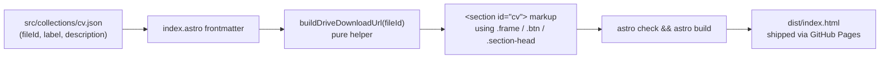

# Design Document

## Overview

The CV Download Section adds a fifth numbered section to the home page (`src/pages/index.astro`), sitting between Experience (`04`) and Contact, that surfaces a single primary call-to-action linking to Steven Siahaan's CV hosted on Google Drive. The section reuses the existing portfolio design language — `.frame` container, `.section` + `.section-head` two-column layout, `.section-eyebrow` numbered marker, `.section-title` serif heading, and the `.btn` pill — without introducing new components, fonts, JavaScript, or runtime dependencies.

The CV source is decoupled from the markup through a small JSON collection (`src/collections/cv.json`) that holds the Google Drive file ID along with display metadata. The home page resolves that ID into a direct-download URL at build time using a tiny pure helper. If the file ID is missing, Astro's frontmatter throws and `astro check && astro build` (the project's existing `pnpm build` script) fails the build with a descriptive error before any HTML is emitted — satisfying Requirement 6.3 without introducing a runtime check.

Because the entire feature is static UI rendering plus configuration validation, property-based testing is not appropriate (see Testing Strategy). Verification relies on Astro's type checker, Biome lint/format, and a manual visual review against the running build.

### Goals

- Add a `<section id="cv">` between Experience and Contact, matching the existing section pattern visually and semantically.
- Renumber the Contact eyebrow from `05 · Contact` to `06 · Contact` so the sequence stays consecutive (`01` About → `02` Work → `03` Capabilities → `04` Experience → `05` CV → `06` Contact).
- Keep the CV file ID in one place (`src/collections/cv.json`) so the owner can change the source without touching markup.
- Ship through `pnpm build` and the existing GitHub Pages workflow with no infrastructure changes.

### Non-goals

- Hosting the CV file inside the repo (the requirements explicitly source it from Google Drive).
- Adding a CV entry to the navigation menu (`src/collections/menu.json`); the requirements only require an `id="cv"` fragment, not a nav link. Adding it is a trivial follow-up if the owner wants it.
- Server-side proxying, file-type sniffing, or analytics on the download.
- Any new JavaScript at runtime; the link is a plain `<a>`.

## Architecture

The feature is a pure-static, build-time composition. There is no server, no API, no client-side state.



Data flow:

1. `src/collections/cv.json` is imported as a typed JSON module in the frontmatter of `src/pages/index.astro` (Astro's existing pattern, used by `experiences.json` and `projects.json`).
2. The frontmatter validates that `fileId` is a non-empty string. If it is missing or empty, it throws an `Error("CV fileId is missing in src/collections/cv.json")`. Astro fails the build and surfaces the error message — covering Requirement 6.3.
3. A small pure helper `buildDriveDownloadUrl(fileId: string)` returns the canonical `https://drive.google.com/uc?export=download&id={fileId}` string. Co-located in the frontmatter to avoid a new module file.
4. The CV section is rendered inline in the home page's `<main>`, immediately before the existing `<section class="contact" id="contact">`.
5. Styles for any CV-specific layout pieces are scoped inside the existing `<style>` block of `index.astro`, alongside the other sections' styles.

### Why no new component file

`src/components/` currently holds only legacy/unused components (`about-experience.astro`, `button.astro`) plus the `header` and `footer`. Every section that ships on the home page (Hero, About, Work, Capabilities, Experience, Contact) is inlined directly inside `index.astro`. Following that established pattern keeps the diff localised, avoids a stray new component, and keeps section-specific styles co-located with the section markup.

## Components and Interfaces

### 1. `src/collections/cv.json` (new file)

A single JSON object — not an array — that mirrors the shape of `menu.json`/`experiences.json` (Astro auto-typed JSON import).

```json
{
  "fileId": "1NxScqC2Rmtg1fqzbdhCtLR3XTApAR2CU",
  "sourceUrl": "https://drive.google.com/file/d/1NxScqC2Rmtg1fqzbdhCtLR3XTApAR2CU/view?usp=sharing",
  "label": "Download CV",
  "ariaLabel": "Download CV (opens in new tab)",
  "description": "A current copy of my CV — ten years of mobile, AI, and product work distilled into two pages. Hosted on Google Drive; click to open or download."
}
```

| Field | Type | Purpose |
|---|---|---|
| `fileId` | `string` | The Google Drive file ID. Single source of truth (Req 6.1). |
| `sourceUrl` | `string` | Optional, kept as documentation of the original Drive viewer URL. Not rendered. |
| `label` | `string` | Visible text inside the `.btn`. |
| `ariaLabel` | `string` | Announced text for assistive tech (Req 4.2). |
| `description` | `string` | The introductory paragraph rendered above the button. |

`sourceUrl` is informational only — the rendered `href` is always derived from `fileId` so a single edit to `fileId` updates everything. Keeping `sourceUrl` in the JSON is a deliberate breadcrumb for the next maintainer; it costs nothing and documents where the file came from.

### 2. `src/pages/index.astro` frontmatter additions

Added at the top of the existing `---` block, alongside the existing `projects` / `experiences` imports:

```ts
import cv from "../collections/cv.json";

if (!cv.fileId || cv.fileId.trim() === "") {
  throw new Error(
    "CV fileId is missing in src/collections/cv.json. " +
    "Set it to the Google Drive file ID before building.",
  );
}

const buildDriveDownloadUrl = (fileId: string): string =>
  `https://drive.google.com/uc?export=download&id=${fileId}`;

const cvDownloadUrl = buildDriveDownloadUrl(cv.fileId);
```

Throwing inside Astro frontmatter aborts SSG with the message visible in `pnpm build` output — exactly the "fail the build with a descriptive error" behaviour Requirement 6.3 calls for.

### 3. CV section markup

Inserted in `index.astro` immediately after the `<!-- ── Experience ── -->` section's closing `</section>` and before the `<!-- ── Contact ── -->` block.

```astro
<!-- ── CV ── -->
<section class="section" id="cv">
  <div class="frame">
    <div class="section-head">
      <span class="section-eyebrow">05 · CV</span>
      <h2 class="section-title">Grab the <em>CV.</em></h2>
    </div>

    <div class="cv-grid">
      <p class="cv-blurb">{cv.description}</p>
      <a
        class="btn"
        href={cvDownloadUrl}
        target="_blank"
        rel="noopener"
        aria-label={cv.ariaLabel}
      >
        {cv.label} <span class="arrow">→</span>
      </a>
    </div>
  </div>
</section>
```

Notable choices:

- `<section class="section" id="cv">` reuses the same wrapper class as About / Work / Capabilities / Experience, so the existing `.section { padding: 120px 0; border-bottom: 1px solid var(--rule); }` rule (and its 720px breakpoint override) applies for free.
- `.section-head` with the two-column `220px 1fr` grid + 720px collapse handles Requirement 5.1 and 5.2 with zero new CSS.
- The `.btn` already provides the focus outline (Req 4.4) via the browser default on the underlying `<a>` plus the existing hover transition.
- `target="_blank"` + `rel="noopener"` are required by the requirements (Req 2.4).
- `aria-label` value comes from the JSON so the announcement copy stays editable in one place (Req 4.2).
- Visible text "Download CV" inside the button satisfies Req 2.5 and gives sighted users an unambiguous action.

### 4. Contact section eyebrow renumbering

The single line in `index.astro`:

```diff
- <span class="section-eyebrow">05 · Contact</span>
+ <span class="section-eyebrow">06 · Contact</span>
```

That's the only change required outside the CV section to satisfy Requirement 3.5.

### 5. Scoped CSS additions

Appended to the existing `<style>` block in `index.astro`. The `.section-head` already gives us the eyebrow/title two-column on desktop and stacks on mobile, so the only new CSS is for the body row (description text + button alignment).

```css
/* ─── CV ─── */
.cv-grid {
  display: grid;
  grid-template-columns: 1.4fr auto;
  gap: 64px;
  align-items: center;
}
.cv-blurb {
  font-size: 17px;
  line-height: 1.65;
  color: var(--ink-soft);
  max-width: 56ch;
  margin: 0;
}
@media (max-width: 900px) {
  .cv-grid {
    grid-template-columns: 1fr;
    gap: 32px;
    align-items: start;
  }
}
```

The desktop layout mirrors `.about-grid` (text on the left, accent element on the right) at a smaller scale. On mobile it stacks. The `.btn` itself already has `padding: 14px 22px` which produces a height comfortably above the 40px touch-target floor (Req 5.3).

### 6. Public component / module surface

| Surface | Type | Owner | Consumers |
|---|---|---|---|
| `src/collections/cv.json` | Static data | Site owner | `index.astro` frontmatter |
| `buildDriveDownloadUrl(fileId)` | Local helper inside `index.astro` frontmatter | This feature | This feature only |
| `<section id="cv">` | DOM landmark | This feature | Anchor links via `/#cv` |

There is no exported module, no new component file, and no shared utility — keeping the change footprint minimal.

## Data Models

### `CvCollection`

The TypeScript shape Astro infers from `cv.json` (no explicit type file needed; Astro's JSON import inference is sufficient for the frontmatter).

```ts
type CvCollection = {
  fileId: string;       // Google Drive file ID, e.g. "1NxScqC2Rmtg1fqzbdhCtLR3XTApAR2CU"
  sourceUrl: string;    // Original viewer URL, informational only
  label: string;        // Visible button text, e.g. "Download CV"
  ariaLabel: string;    // Accessible name announced to screen readers
  description: string;  // Body copy paragraph above the button
};
```

Constraints (enforced by the frontmatter `if` check; documented here for future maintenance):

- `fileId` MUST be a non-empty trimmed string. Any other field being empty is a soft warning (not enforced) — those degrade gracefully because the markup will still render an empty paragraph or button label.
- `fileId` is treated as opaque; no character-class validation. Drive file IDs are typically `[A-Za-z0-9_-]{25,}` but Google has changed this format historically, so we don't try to over-constrain.

### Derived value

```ts
cvDownloadUrl: string = `https://drive.google.com/uc?export=download&id=${cv.fileId}`
```

This is the only computed value in the feature. It is computed once per build per page render (the home page) and inlined into the rendered HTML.

## Error Handling

There is no runtime error surface for visitors — the rendered page is a static `<a>` with a fixed `href`. The error model is entirely build-time and external-redirect.

### Build-time errors

| Condition | Mechanism | Outcome |
|---|---|---|
| `cv.json` is missing entirely | Astro's TS resolver fails the import | `astro check` fails with a "Cannot find module" error before `astro build` runs |
| `cv.json` is malformed JSON | Vite's JSON loader throws | `pnpm build` fails with a JSON parse error pointing at the file |
| `cv.fileId` is missing or empty | Explicit `throw new Error(...)` in frontmatter | `pnpm build` fails with the descriptive message defined above (Req 6.3) |
| `cv.json` lacks the type Astro inferred (e.g. `fileId` not a string) | `astro check` (TypeScript) | Build fails before producing `dist/` |

### Runtime / external errors

| Condition | Behaviour | Rationale |
|---|---|---|
| Visitor clicks the button while offline | Browser shows its own offline error | Standard `<a target="_blank">` semantics; out of scope |
| Google Drive returns "Quota exceeded for this file" or "File not found" | Visitor sees Google Drive's own error page in the new tab | We can't detect or recover from this without a server; documented as a manual ops concern. The site owner verifies the link periodically |
| Browser blocks the new tab (popup blocker) | The browser surfaces its own UI | Default `<a target="_blank">` activated by user click is rarely blocked, since it is a direct user gesture |
| User has Drive download disabled or file is restricted | Drive shows preview instead of download | Acceptable per Requirement 2.3 ("…initiates a file download or Google Drive preview") |

The `rel="noopener"` attribute removes any opener handle from the new tab, mitigating reverse-tabnabbing on the (extremely unlikely) chance that drive.google.com is ever compromised — required by Req 2.4 and a baseline security practice for `target="_blank"` links.

### Fallback behaviour during owner edits

If the owner is mid-edit and saves a `cv.json` with `"fileId": ""`, the site does not deploy a broken link — the GitHub Actions workflow's `pnpm build` step fails, the deploy step never runs, and the previous `dist/` stays live on Pages. That is the intended safety net.

## Testing Strategy

### PBT applicability assessment

This feature is a thin layer of three things:

1. **Static configuration** (`cv.json`) — schema validation territory, not PBT.
2. **UI markup** (`<section>` rendering with fixed copy and a fixed link target) — UI rendering, explicitly called out in the workflow as not appropriate for PBT. Snapshot-style verification is the right tool, but the project ships no test framework, no test runner, and no snapshot tooling.
3. **A trivial pure helper** (`buildDriveDownloadUrl`) — technically PBT-amenable in isolation (e.g., "for any string `id`, the returned URL contains `id`"), but the helper is a single template literal with no branching. The cost of standing up a test framework, picking a property-based testing library, and configuring 100 iterations to validate `\`...id=${x}\`` produces something containing `${x}` exceeds the cost of just reading the line of code. The bug surface area is zero.

Per the workflow guidance ("Configuration validation: use schema validation and example-based tests instead", "UI rendering and layout: use snapshot tests"), and given the project has no existing test infrastructure to extend, **the Correctness Properties section is intentionally omitted** and PBT is not part of the verification plan.

### Verification approach

Verification leans on the toolchain that already gates the GitHub Pages deploy.

#### 1. Build-time gate: `pnpm build`

`pnpm build` runs `astro check && astro build`. This is the deploy gate (`.github/workflows/deploy.yml`) and validates:

- TypeScript types of the imported JSON (covers `CvCollection` shape mismatches).
- Astro template syntax in the new section markup.
- The frontmatter `if (!cv.fileId)` throw path — exercise it by temporarily blanking the field and confirming the build fails with the expected message, then restoring it.
- The happy path produces `dist/index.html` containing `id="cv"` and the expected `href`.

#### 2. Lint gate: `pnpm check`

Biome runs against `index.astro` and `cv.json`. Both must pass without warnings (Req 7.3). Run before committing.

#### 3. Manual verification checklist

After `pnpm build && pnpm preview`, walk the following list:

| # | Check | Requirement covered |
|---|---|---|
| 1 | Visit `/` — CV section visible between Experience and Contact | 1.1, 1.4 |
| 2 | Section has eyebrow `05 · CV`, an `<h2>` title, a paragraph, and one button | 1.2, 4.3 |
| 3 | Inspect element: outer wrapper has `id="cv"`; `/#cv` scrolls to it | 1.3 |
| 4 | Button `href` equals `https://drive.google.com/uc?export=download&id={fileId}` | 2.2, 2.3, 6.2 |
| 5 | Button has `target="_blank"`, `rel="noopener"`, non-empty visible text, `aria-label` | 2.4, 2.5, 4.1, 4.2 |
| 6 | Click button — Drive download or preview opens in new tab | 2.3 |
| 7 | Tab through the page — focus reaches the button with a visible outline | 4.1, 4.4 |
| 8 | Resize to 320px — content stays in one column, no horizontal scroll, button height ≥ 40px | 5.1, 5.3 |
| 9 | Resize to 1024px — `.section-head` is two-column like neighbours | 5.2 |
| 10 | Contact eyebrow now reads `06 · Contact`, no other section numbers shifted | 3.4, 3.5 |
| 11 | Computed styles on title use `var(--serif)`, eyebrow uses `var(--mono)`, button uses existing `.btn` rule | 3.1, 3.2, 3.3 |
| 12 | Edit `cv.json` `fileId` to a different value, rerun `pnpm build`, button `href` updates without other source changes | 6.1, 6.2 |
| 13 | Set `cv.json` `fileId` to `""`, rerun `pnpm build`, build fails with the descriptive error message | 6.3 |
| 14 | `pnpm check` exits clean | 7.3 |
| 15 | `pnpm build` succeeds and `dist/index.html` contains the rendered section | 7.1, 7.2 |

#### 4. Accessibility spot-check

Beyond the structural checks above, run a one-off Lighthouse / axe DevTools pass against the local preview to confirm:

- The new button has an accessible name (visible text + `aria-label`).
- Heading order remains valid: `h1` (hero) → `h2` (each section title, including CV).
- Color contrast on the button matches existing buttons (it uses identical tokens, so this is a regression check, not a new concern).

This is a manual step done once at landing time; it doesn't need to be part of the CI gate.

#### 5. What we are deliberately NOT doing

- **No unit test framework.** Adding Vitest or similar to a static portfolio with one trivial helper is not justified. If the project later gains a test framework for other reasons, `buildDriveDownloadUrl` is a fine candidate for an example-based unit test.
- **No property-based tests.** Justified above.
- **No e2e tests.** Playwright/Cypress for a static portfolio with one new link is over-engineered. Manual verification is sufficient and matches the project's current posture.
- **No link-health monitoring.** The link points to an external Google Drive resource; proactive monitoring belongs to the site owner's ops, not this feature.
